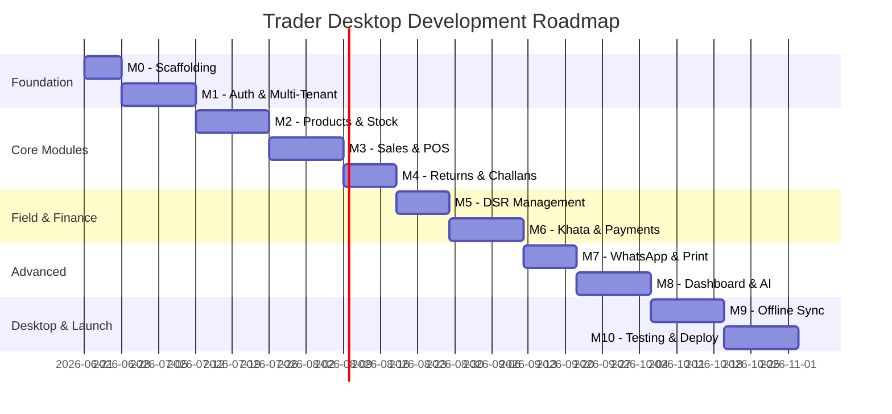

<div align="center">


<br/>


<br/><br/>

<p align="center">
  
  
  
  
  
</p>

<p align="center">
  
  
  
  
  
</p>

<br/>


</div>

---

## 📋 Table of Contents

- [About](#-about)
- [Key Features](#-key-features)
- [Tech Stack](#️-tech-stack)
- [Architecture](#️-architecture)
- [Modules](#-modules)
- [Project Structure](#-project-structure)
- [Getting Started](#-getting-started)
- [Environment Variables](#-environment-variables)
- [Milestone Roadmap](#-milestone-roadmap)
- [API Endpoints](#-api-endpoints)
- [Contributing](#-contributing)

---

## 🏪 About

**Trader Desktop 2.0** is a comprehensive **offline-first, multi-tenant B2B/B2C SaaS ERP** system purpose-built for the Pakistani wholesale and distribution market — specifically designed for traders in **Jodia Bazar (Karachi)**, **Akbari Mandi (Lahore)**, and FMCG distribution networks.

The system replaces centuries-old paper-based *"Munshi"* ledger systems, WhatsApp-based order tracking, and expensive enterprise ERPs that are too complex for the average wholesale trader. It brings enterprise-grade features — multi-tenant data isolation, hierarchical inventory management, landed cost calculation, field force tracking — into a simple, keyboard-first interface that any dukaandar can use.

> **Internal Codename:** `newtrade`

---

## ✨ Key Features

<table>
<tr>
<td width="50%">

### 🏗️ Core
- **Multi-Tenant Architecture** — Database-per-tenant isolation with LRU connection pooling
- **Offline-First Desktop** — Realm SDK local DB + automatic cloud sync via Electron
- **5-Tier RBAC** — SUPER_ADMIN, ADMIN, MANAGER, SALES, VIEWER
- **Keyboard-First UX** — F2 (New Sale), F3 (Challan), Ctrl+F (Search)

</td>
<td width="50%">

### 📦 Business
- **Hierarchical Units** — Bori → Peti → Piece auto-conversion
- **Landed Cost Engine** — Freight, Palledari, Hamali, Tulai proportional allocation
- **Credit Limit Enforcement** — Dynamic checks with manager override
- **WhatsApp Integration** — One-click ledger PDF sharing

</td>
</tr>
<tr>
<td width="50%">

### 💰 Financial
- **Khata (Ledger)** — Auto-updating customer/vendor financial records
- **Maker-Checker Expenses** — Approval workflow for business expenses
- **DSR Management** — Currency denomination breakdown + cash verification
- **Returns Processing** — Auto stock re-addition + ledger reversal

</td>
<td width="50%">

### 🖨️ Operations
- **Silent Printing** — Electron native IPC, no dialog popup (< 2s)
- **Delivery Challans** — Required vs. Supplied qty + status lifecycle
- **Quick POS** — Touch-friendly counter sales with thermal receipts
- **AI Assistant (Jarvis)** — Gemini-powered natural language reporting

</td>
</tr>
</table>

---

## 🛠️ Tech Stack

<div align="center">

### Frontend
| Layer | Technology |
|---|---|
| UI Framework | **React 19** (latest) |
| Build Tool | **Vite 8** |
| Styling | **Tailwind CSS 4** + custom CSS |
| Routing | **React Router DOM 7** |
| HTTP Client | **Axios** with interceptor layer |
| Forms | **React Hook Form** |
| Charts | **Recharts** |
| Icons | **Lucide React** |
| Notifications | **Sonner** |

### Backend
| Layer | Technology |
|---|---|
| Runtime | **Node.js** (latest LTS) |
| Framework | **Express 5** |
| Database | **MongoDB Atlas** (cloud) |
| ODM | **Mongoose 9** |
| Auth | **JWT** + Refresh Tokens |
| Validation | **Joi** |
| File Upload | **Multer + Cloudinary** |
| Security | **Helmet, express-mongo-sanitize, CORS, Rate Limiting** |

### Desktop (Future)
| Layer | Technology |
|---|---|
| Desktop | **Electron.js** |
| Local DB | **Realm SDK** |
| Sync | **syncCore.js + syncProcessor.js** |

</div>

---

## 🏗️ Architecture

```
┌─────────────────────────────────────────────────────────┐
│                    CLIENT LAYER                          │
│  ┌──────────────────┐    ┌───────────────────────────┐  │
│  │  Web App (React) │    │  Desktop App (Electron)   │  │
│  │  + Vite + TW     │    │  + Realm (offline DB)     │  │
│  │  Deployed: Vercel│    │  + Sync Engine            │  │
│  └────────┬─────────┘    └───────────┬───────────────┘  │
│           │       HTTPS / REST        │                  │
│           │      (JWT Bearer)         │  IPC (printing)  │
└───────────┼───────────────────────────┼──────────────────┘
            │                           │
┌───────────▼───────────────────────────▼──────────────────┐
│                  API GATEWAY LAYER                        │
│  Node.js + Express                                       │
│  - authMiddleware (JWT → companyId)                      │
│  - DatabaseManager (LRU connection pool)                 │
│  - Rate limiting, Helmet, sanitization                   │
└────────────────────────────────┬─────────────────────────┘
                                 │
┌────────────────────────────────▼─────────────────────────┐
│                  DATA LAYER                               │
│  ┌──────────────┐  ┌──────────────┐  ┌────────────────┐  │
│  │ MongoDB Atlas│  │  Cloudinary  │  │ Redis (opt.)   │  │
│  │ DB-per-tenant│  │  Image/File  │  │  Cache         │  │
│  └──────────────┘  └──────────────┘  └────────────────┘  │
└──────────────────────────────────────────────────────────┘
```

---

## 📦 Modules

<div align="center">

| Module | Description | Status |
|---|---|---|
| 🔐 **Auth & RBAC** | JWT auth, multi-tenant DB resolution, 5-role access control | `M1` |
| 📦 **Products & Stock** | Hierarchical units (Bori/Peti/Piece), barcode, wastage tracking | `M2` |
| 🛒 **Sales & POS** | Invoice creation (< 30s), credit checks, Quick POS, print | `M3` |
| 🔄 **Returns & Challans** | Return processing, delivery tracking, status lifecycle | `M4` |
| 📋 **DSR** | Salesman field force, currency breakdown, daily sheets | `M5` |
| 💳 **Khata & Finance** | Customer/vendor ledgers, payments, Maker-Checker expenses | `M6` |
| 📱 **WhatsApp & Print** | Ledger sharing, invoice template editor, Puppeteer PDF | `M7` |
| 📊 **Dashboard & Reports** | Real-time analytics, low-stock alerts, Jarvis AI | `M8` |
| 💻 **Offline Sync** | Electron + Realm local DB + bi-directional cloud sync | `M9` |
| 🧪 **Testing & Deploy** | Unit/integration tests, Vercel deployment, optimization | `M10` |

</div>

---

## 📁 Project Structure

```
newtrade/
├── client/                     # React + Vite Frontend
│   ├── src/
│   │   ├── components/         # Reusable UI components
│   │   ├── context/            # React Context (Auth, App)
│   │   ├── hooks/              # Custom hooks
│   │   ├── layouts/            # Layout wrappers
│   │   ├── pages/              # Page-level components by module
│   │   │   ├── admin/          # Super admin panel
│   │   │   ├── auth/           # Login page
│   │   │   ├── challans/       # Delivery challans
│   │   │   ├── customers/      # Customer management
│   │   │   ├── dsr/            # Daily Sales Reports
│   │   │   ├── expenses/       # Business expenses
│   │   │   ├── payments/       # Payment processing
│   │   │   ├── pos/            # Quick POS
│   │   │   ├── products/       # Product management
│   │   │   ├── purchases/      # Purchase entry
│   │   │   ├── reports/        # Reports & analytics
│   │   │   ├── returns/        # Returns management
│   │   │   ├── sales/          # Sales invoices
│   │   │   ├── settings/       # Company settings
│   │   │   ├── stock/          # Stock overview
│   │   │   └── vendors/        # Vendor management
│   │   ├── services/           # Axios API service layer
│   │   ├── utils/              # Utilities (formatters, validators)
│   │   ├── App.jsx             # Root component + routes
│   │   └── main.jsx            # Entry point
│   ├── .env                    # Frontend env variables
│   └── vite.config.js          # Vite configuration
│
├── server/                     # Node.js + Express Backend
│   ├── src/
│   │   ├── config/             # DB, Cloudinary, Redis config
│   │   ├── controllers/        # Request handlers (per resource)
│   │   ├── middleware/         # Auth, RBAC, tenant, error, rate limit
│   │   ├── models/             # Mongoose schemas
│   │   ├── routes/             # Express route definitions
│   │   ├── services/           # Business logic layer
│   │   ├── utils/              # Utility functions
│   │   ├── validators/         # Joi validation schemas
│   │   ├── app.js              # Express app setup
│   │   └── server.js           # Entry point
│   ├── .env                    # Backend env variables
│   └── .env.example            # Environment template
│
├── docs/                       # Project Documentation
│   ├── PRD.md                  # Product Requirements Document
│   ├── SRD.md                  # Software Requirements Document
│   ├── TRD.md                  # Technical Requirements Document
│   ├── AGENT_GUIDE.md          # AI Agent Development Guide
│   ├── AGENT_PROGRESS.md       # Milestone Progress Tracker
│   ├── VERCEL_DEPLOY.md        # Vercel Deployment Guide
│   └── rules.md                # Project Coding Rules
│
└── .gitignore
```

---

## 🚀 Getting Started

### Prerequisites

- **Node.js** (latest LTS)
- **MongoDB Atlas** account (or local MongoDB)
- **Cloudinary** account (for image uploads)

### Installation

```bash
# Clone the repository
git clone https://github.com/Konete326/newtrade.git
cd newtrade

# Install backend dependencies
cd server
npm install

# Install frontend dependencies
cd ../client
npm install
```

### Running Locally

```bash
# Terminal 1 — Start backend (port 5000)
cd server
npm run dev

# Terminal 2 — Start frontend (port 5173)
cd client
npm run dev
```

Open [http://localhost:5173](http://localhost:5173) in your browser.

### Default Login

| Field | Value |
|---|---|
| Email | `SUPER_ADMIN_EMAIL` from `.env` |
| Password | `SUPER_ADMIN_PASSWORD` from `.env` |

> The super admin account is auto-created on first server startup from environment variables.

---

## 🔐 Environment Variables

### Backend (`server/.env`)

| Variable | Required | Description |
|---|---|---|
| `MONGO_URI` | ✅ | MongoDB Atlas connection string |
| `JWT_SECRET` | ✅ | JWT signing secret (32+ chars) |
| `JWT_REFRESH_SECRET` | ✅ | Refresh token secret (32+ chars) |
| `FIELD_ENCRYPTION_KEY` | ✅ | AES-256 field encryption key (exactly 32 chars) |
| `SUPER_ADMIN_EMAIL` | ✅ | Auto-created super admin email |
| `SUPER_ADMIN_PASSWORD` | ✅ | Auto-created super admin password |
| `NODE_ENV` | ✅ | `development` or `production` |
| `FRONTEND_URL` | ✅ | Frontend URL for CORS |
| `CLOUDINARY_CLOUD_NAME` | ✅ | Cloudinary cloud name |
| `CLOUDINARY_API_KEY` | ✅ | Cloudinary API key |
| `CLOUDINARY_API_SECRET` | ✅ | Cloudinary API secret |
| `REDIS_URL` | ❌ | Redis connection (graceful degradation) |
| `GEMINI_API_KEY` | ❌ | Google Gemini for Jarvis AI |
| `WHATSAPP_TOKEN` | ❌ | WhatsApp Business API token |

### Frontend (`client/.env`)

| Variable | Required | Description |
|---|---|---|
| `VITE_API_URL` | ✅ | Backend API base URL |
| `VITE_STORAGE_ENCRYPTION_KEY` | ✅ | Client storage encryption key |

---

## 🗺️ Milestone Roadmap

<div align="center">



</div>

| Milestone | Scope | Key Deliverable |
|---|---|---|
| **M0** | Scaffolding, env, folder structure | Runnable empty app |
| **M1** | Auth, RBAC, multi-tenant DB | Login + tenant isolation |
| **M2** | Products, stock, unit engine | Inventory CRUD |
| **M3** | Sales, Quick POS, pricing | Invoice creation (< 30s) |
| **M4** | Returns, delivery challans | Logistics flow |
| **M5** | DSR, currency breakdown | Field force management |
| **M6** | Khata, payments, expenses | Financial core |
| **M7** | WhatsApp, print templates | Communication & print |
| **M8** | Dashboard, reports, Jarvis | Analytics & AI |
| **M9** | Offline sync, Electron | Desktop offline-first |
| **M10** | Testing, optimization | Production release |

---

## 🔌 API Endpoints

<details>
<summary><b>Authentication</b></summary>

| Method | Endpoint | Description |
|---|---|---|
| `POST` | `/api/v1/auth/login` | Login |
| `POST` | `/api/v1/auth/refresh` | Refresh token |
| `POST` | `/api/v1/auth/logout` | Logout |
| `GET` | `/api/v1/auth/me` | Current user |

</details>

<details>
<summary><b>Products & Stock</b></summary>

| Method | Endpoint | Description |
|---|---|---|
| `GET` | `/api/v1/products` | List products |
| `POST` | `/api/v1/products` | Create product |
| `GET` | `/api/v1/products/barcode/:code` | Barcode lookup |
| `GET` | `/api/v1/stock` | Stock overview |
| `POST` | `/api/v1/stock/adjust` | Wastage adjustment |

</details>

<details>
<summary><b>Sales & Returns</b></summary>

| Method | Endpoint | Description |
|---|---|---|
| `GET` | `/api/v1/sales` | List sales |
| `POST` | `/api/v1/sales` | Create sale |
| `GET` | `/api/v1/returns` | List returns |
| `POST` | `/api/v1/returns` | Create return |

</details>

<details>
<summary><b>DSR & Challans</b></summary>

| Method | Endpoint | Description |
|---|---|---|
| `GET` | `/api/v1/dsr` | List DSRs |
| `POST` | `/api/v1/dsr/:id/settle` | Settle DSR |
| `GET` | `/api/v1/challans` | List challans |
| `PATCH` | `/api/v1/challans/:id/status` | Update status |

</details>

<details>
<summary><b>Finance & Reports</b></summary>

| Method | Endpoint | Description |
|---|---|---|
| `POST` | `/api/v1/payments/receive` | Receive payment |
| `GET` | `/api/v1/customers/:id/ledger` | Customer ledger |
| `PATCH` | `/api/v1/expenses/:id/approve` | Approve expense |
| `GET` | `/api/v1/reports/dashboard` | Dashboard metrics |

</details>

---

## 🤝 Contributing

1. Fork the repository
2. Create a feature branch (`git checkout -b feature/amazing-feature`)
3. Commit your changes (`git commit -m 'Add amazing feature'`)
4. Push to the branch (`git push origin feature/amazing-feature`)
5. Open a Pull Request

---

<div align="center">


<br/>


<br/><br/>

**⭐ Star this repo if you find it useful!**

</div>
